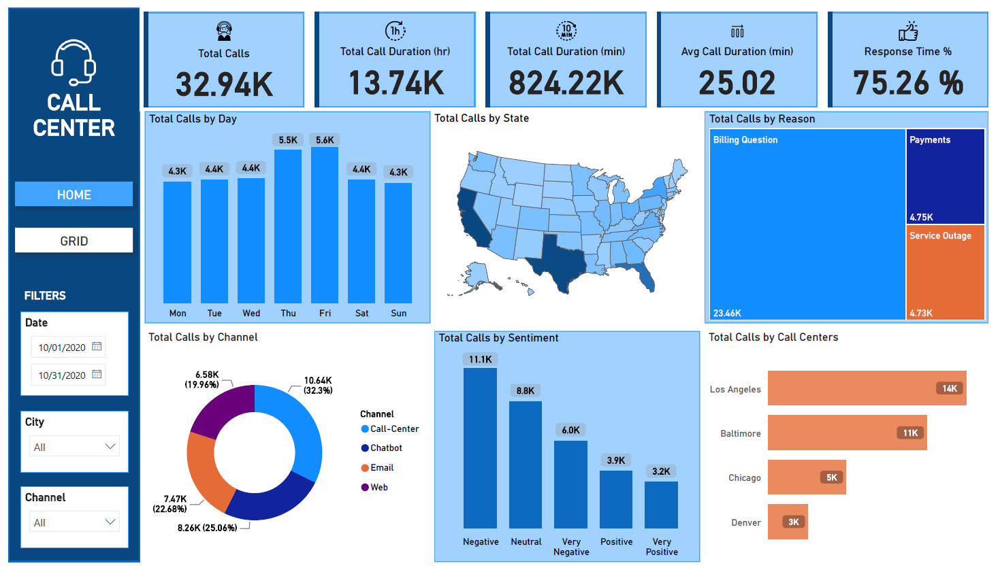

<a name="readme-top"></a>

<div align="center">

  
  <br/>

</div>

<!-- TABLE OF CONTENTS -->

# 📗 Table of Contents

- [📖 About the Project](#about-project)
  - [🛠 Built With](#built-with)
- [💻 Getting Started](#getting-started)
  - [Prerequisites](#prerequisites)
  - [Setup](#setup)
- [👥 Authors](#authors)
- [🤝 Contributing](#contributing)
- [⭐️ Show your support](#support)
- [🙏 Acknowledgements](#acknowledgements)
- [📝 License](#license)

<!-- PROJECT DESCRIPTION -->

# 📖 Call Center Data Analysis <a name="about-project"></a>

The Call Center Data Analysis repository offers an in-depth exploration of call center operations during the month of October 2020, with a focus on a United States-based office. Utilizing advanced analytics and visualizations in Power BI, this project delves into a diverse dataset, capturing key metrics and insights crucial to understanding call center performance.



</br>

Questions answered with this dashboard

1. Display a list of the most important KPIs and total call duration times. What is the response time percentage?

2. Which are the busiest days throughout the week? What are the most common reasons for calls?

3. Display a map with the total number of calls in the country. What channels are customers using to seek assistance in the call center?

4. What is the sentiment of customers based on the support they receive?

## 🛠 Built With <a name="built-with"></a>


<details>
  <summary>Tech Stack</summary>
  <ul>
    <li>Power BI</li>
    <li>Power Query</li>
    <li>Microsoft Excel</li>
  </ul>
</details>

<!-- GETTING STARTED -->

## 💻 Getting Started <a name="getting-started"></a>

To get a local copy up and running, follow these steps.

### Prerequisites

- Visual Studio Code
- Basic understanding of Power BI & Power Query
- Git Bash

### Setup

Clone this repository to your desired folder:

```sh
git clone https://github.com/HunterX-7/Call-Center-DA.git
```

<!-- AUTHORS -->

## 👥 Author <a name="authors"></a>

👤 **Francisco Quintero**

- GitHub: [@HunterX-7](https://github.com/HunterX-7)
- LinkedIn: [Francisco Quintero](https://www.linkedin.com/in/francisco-asis-quintero-cede%C3%B1o/)

<!-- CONTRIBUTING -->

## 🤝 Contributing <a name="contributing"></a>

Contributions, issues, and feature requests are welcome!

Feel free to check the [issues page](https://github.com/HunterX-7/Call-Center-DA/issues).

<!-- SUPPORT -->

## ⭐️ Show your support <a name="support"></a>

Give a ⭐️ if you like this project!

<!-- Acknowledgments -->

## 🙏 Acknowledgments <a name="acknowledgements"></a>

Hat tip to anyone whose code was used.

<!-- LICENSE -->

## 📝 License <a name="license"></a>

This project is [MIT](./LICENSE) licensed.

<p align="right">(<a href="#readme-top">Back to top</a>)</p>
